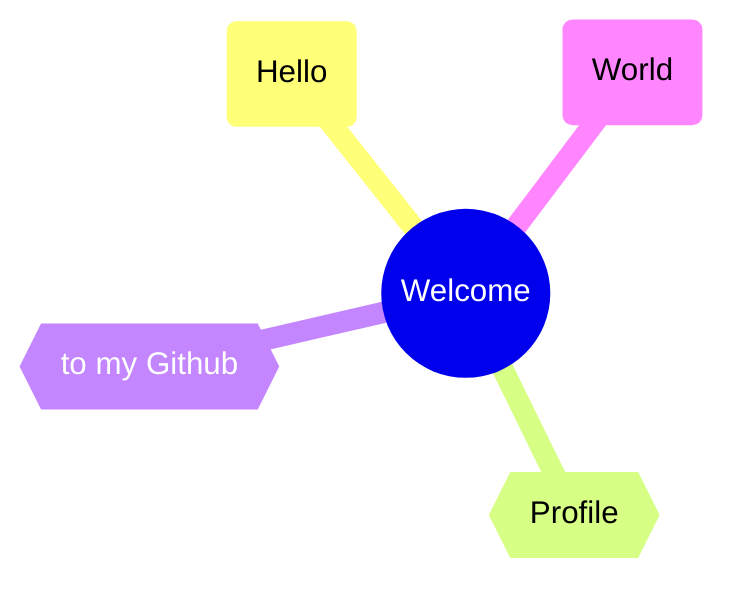
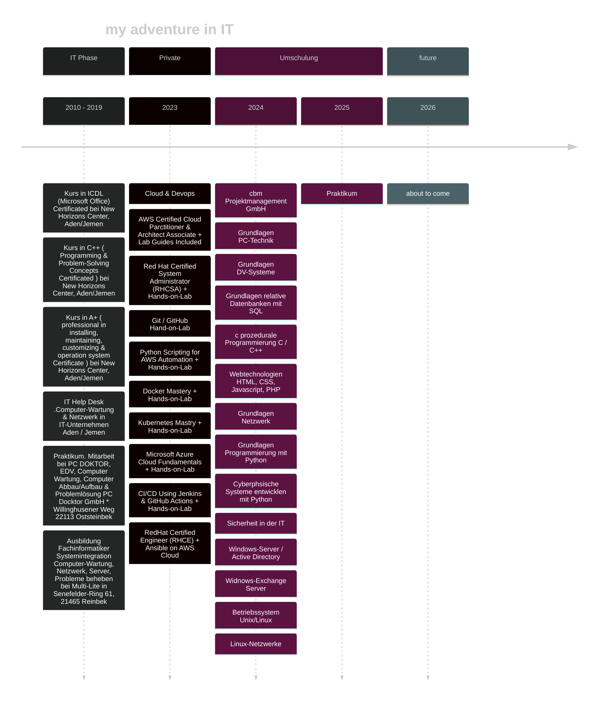

<h4 align="center">Omar</h4>



## About me


```java
public class About extends Me{
    public String name = "Omar";
    public String city = "Hamburg";
    public String current_work = "Junior Cloud & DevOps Engineer";
    
    private void Ambitions() {
        FindInternship();
        CreateSkyNet();
    }
}
```




## projects

**Aws**
  - [AWS](https://github.com/Devops-Omar/AWS_Projects)

**Docker**

  - [Docker](https://github.com/Devops-Omar/Docker-Project)

**Kubernetes**

  - [Kubernets](https://github.com/Devops-Omar/K8s)
    
**Umschulung [@cbm](https://cbm-projektmanagement.de/) (Bildungsträger)**

**Projekte**
  - [php & Kubernnetes](https://github.com/Devops-Omar/k8s-project)
  - [NetzwerkGrundlagen](https://github.com/Devops-Omar/NetzwerkGrundlagen)
  - [Vertiefung_Netwerkgrundlagen](https://github.com/DevOpsCloudOm4r/Vertiefung_Netwerkgrundlagen)
  - [IT-Security](https://github.com/DevOpsCloudOm4r/IT-Scueity)
  - [IHK final Project](https://github.com/DevOpsCloudOm4r/secure-nextcloud-dmz-vpn-vps_relay)


## contact me

[](mailto:omar.membership@gmail.com)

## Skills


             
          
<div>
  <a href="https://aws.amazon.com/" target="_blank">
    
  </a>
  <a href="https://www.kernel.org/" target="_blank">
    
  </a>
  <a href="https://ubuntu.com/" target="_blank">
  
  </a>
  <a href="https://ubuntu.com/" target="_blank">
  
  </a>
  <a href="https://www.docker.com/" target="_blank">
   
  </a>
  <a href="https://kubernetes.io/" target="_blank">
    
  </a>
  <a href="https://www.debian.org/" target="_blank">
    
  </a>
  <a href="https://www.python.org/" target="_blank">
    
  </a>
  <a href="https://www.autohotkey.com/" target="_blank">
    
  </a>
  <a href="https://learn.microsoft.com/en-us/virtualization/hyper-v-on-windows/about/" target="_blank">
  
  </a>
  <br>
  <a href="https://www.proxmox.com/" target="_blank">
  
  </a>
  <a href="https://www.pfsense.org/" target="_blank"> 
   
  <i class="devicon-pfsense-original"></i>        
  </a>
  <a href="https://www.terraform.io/" target="_blank">
    
  </a>
  <a href="https://git-scm.com/" target="_blank">
    
  </a>
  <a href="https://github.com/" target="_blank">
    
  </a>
  <br>
  <a href="https://mermaid.js.org/" target="_blank">
    
  </a>
  <a href="https://app.diagrams.net/" target="_blank">
    
  </a>
  <a href="https://code.visualstudio.com/" target="_blank">
    
  </a>
</div>
